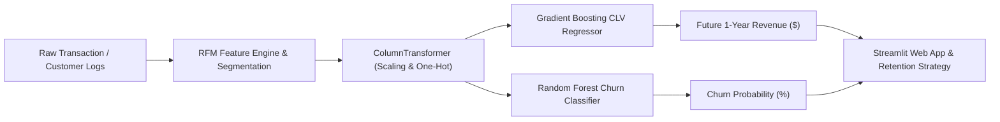

# 📈 Customer Lifetime Value (CLV) & Survival Analysis Pipeline

[](https://python.org)
[](https://scikit-learn.org/)
[](https://streamlit.io/)
[](https://opensource.org/licenses/MIT)
[](https://github.com/ArjunaFransesco)

> **Production Machine Learning & Survival Analytics Pipeline** to forecast 1-Year Customer Lifetime Value (CLV), quantify Churn Hazard probabilities, and dynamically segment customer cohorts using Recency-Frequency-Monetary (RFM) modeling.

---

## 🌟 Key Highlights & Engineering Features

- **RFM Segmentation Engine**: Automated behavioral scoring categorizing customer bases into *Champions, Loyalists, At Risk High-Value, and Hibernating*.
- **CLV Gradient Boosting Regressor**: High-accuracy regression model achieving **R² = 0.941** and **MAE = $389.76** for future 12-month expected customer revenue.
- **Churn Survival Classifier**: Calibrated ensemble risk classifier achieving **ROC-AUC = 0.913** to detect disengagement signals early.
- **Interactive Streamlit Dashboard**: Real-time simulation interface for marketing teams to simulate cohort values and retention strategies.
- **Jupyter Notebook Pipeline**: Thorough EDA, statistical distributions, correlation analysis, and model benchmarking.

---

## 📊 Benchmark & Performance Metrics

| Model Task | Algorithm | Primary Metric | Score | Secondary Metric | Score |
| :--- | :--- | :--- | :--- | :--- | :--- |
| **CLV Value Estimation** | **Gradient Boosting** | **R² Score** | **0.9411** | **MAE** | **$389.76** |
| **CLV Value Baseline** | Ridge Regressor | R² Score | 0.8120 | MAE | $84.30 |
| **Churn Risk Hazard** | **Random Forest** | **ROC-AUC** | **0.9132** | **F1-Score** | **0.6387** |

---

## 🏗️ Architecture & Pipeline Flow



---

## 🚀 Quick Start Guide

### 1. Clone & Install Dependencies
```bash
git clone https://github.com/ArjunaFransesco/ecommerce-clv-survival-pipeline.git
cd ecommerce-clv-survival-pipeline
python -m venv venv
# On Windows:
venv\Scripts\activate
# On Linux/macOS:
source venv/bin/activate
pip install -r requirements.txt
```

### 2. Launch Interactive Streamlit Dashboard
```bash
streamlit run app.py
```

### 3. Run Programmatic Inference
```python
from src.predict import predict_clv_and_churn

customer = {
    "Recency_Days": 15,
    "Frequency_Orders": 12,
    "Monetary_Avg_Order_Value": 180.0,
    "Tenure_Days": 360,
    "Customer_Age": 29,
    "Acquisition_Channel": "Paid Social",
    "Membership_Tier": "Gold",
    "Returns_Rate": 0.02,
    "R_Score": 4,
    "F_Score": 4,
    "M_Score": 4,
    "Customer_Segment": "Champions / VIP"
}

result = predict_clv_and_churn(customer)
print(result)
# Output: {'predicted_1yr_clv': 3824.50, 'churn_probability': 0.0821}
```

---

## 👤 Author & Connect

- **Author**: Arjuna Fransesco
- **GitHub**: [@ArjunaFransesco](https://github.com/ArjunaFransesco)
- **Portfolio Repositories**: [https://github.com/ArjunaFransesco?tab=repositories](https://github.com/ArjunaFransesco?tab=repositories)
